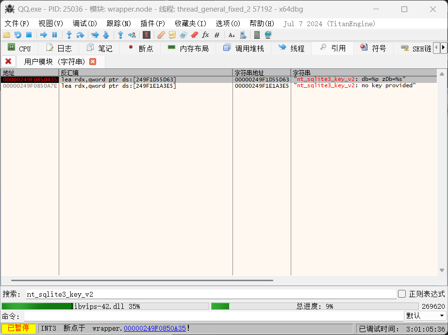
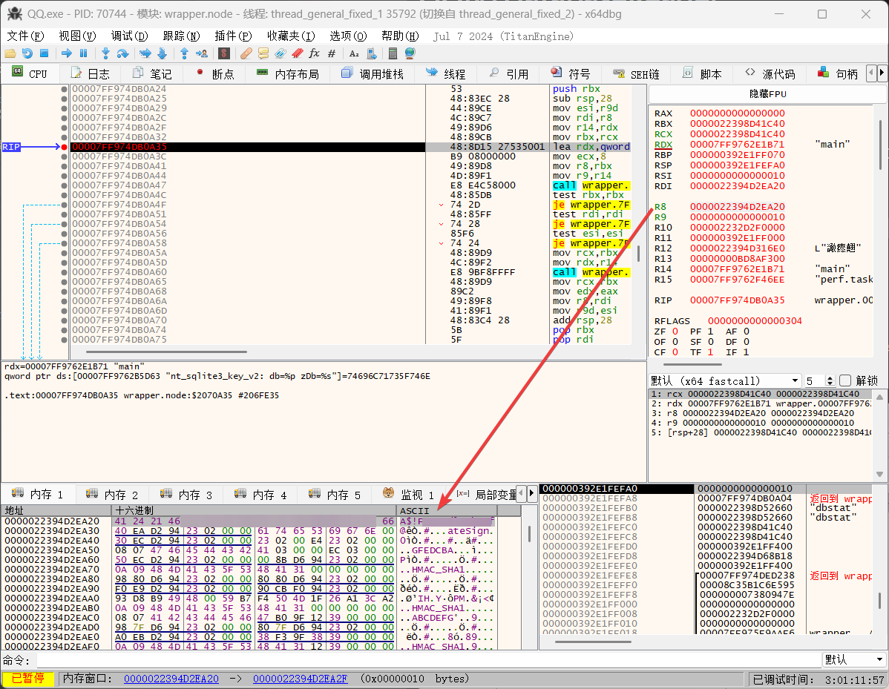

# QQNTDatabaseReader

QQNT数据库读取

- 自动寻找 QQNTWindows 的数据库密码
- 无需拷贝数据库即可读取原始加密的数据库
- 导出成无加密的数据库文件

## 数据库密码

数据库密码可以通过QQDatabaseKeyFinder来自动获取, 或者可以手动用调试器来获取

### 手动找 QQNT Windows 数据库密码

- 用x64dbg打开一个新的QQ进程(C:\Program Files\Tencent\QQNT\QQ.exe), 或者附加进程, 进入到QQ的登录界面
- 等到模块列表里有这个模块: `wrapper.node`
- 然后转到CPU, 右键->搜索->所有用户模块->字符串, 搜索`nt_sqlite3_key_v2` (这个字符串在`wrapper.node`模块的`.rdata`段里)
- 找到`nt_sqlite3_key_v2: db=%p zDb=%s`, 右键选择切换断点或者按F2来切换断点, 设置上断点
- 之后在QQ登录界面点击登录, 会触发刚刚打的断点
- 触发断点后`rdx`寄存器应该是`main`字符串, `r8`寄存器就是数据库密码的地址
- 右键`r8`寄存器, 转到内存窗口就能看到密码了, 密码是16长度的ASCII码字符串

## 鸣谢
- https://github.com/mobyw/GroupChatAnnualReport
- https://cyp0633.icu/post/android-qqnt-export
- https://github.com/artiga033/ntdb_unwrap
- https://docs.aaqwq.top/view/db_file_analysis/
- https://blog.reincarnatey.net/2024/0707-qqnt-history-export/
