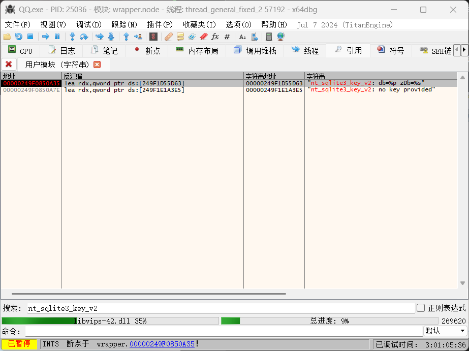
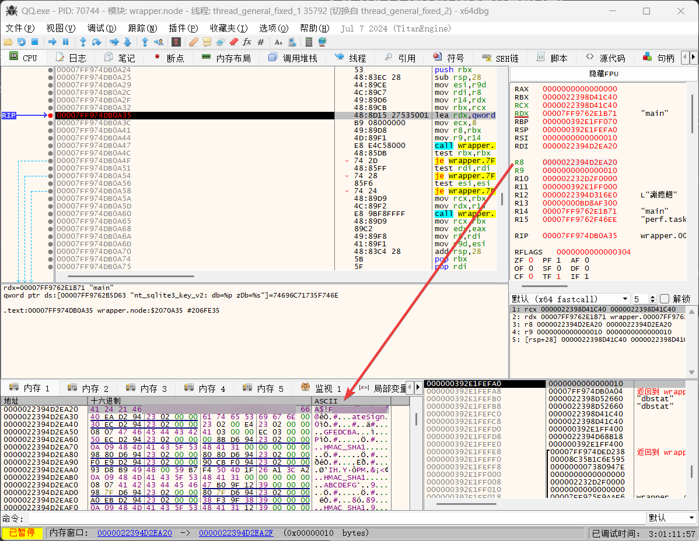

# QQDatabaseReader

QQ / QQNT 本地聊天数据库读取和浏览工具.

这个项目用于读取本地 QQ 聊天数据库, 在桌面界面中浏览和搜索聊天记录, 并尽量还原消息里的回复, 图片, 表情, 戳一戳和系统提示等内容.

## 功能

- 浏览私聊和群聊消息.
- 搜索聊天记录.
- 显示好友昵称, 群名, 群成员昵称和备注等资料.
- 读取本地图片, 图片表情, 语音和视频资源.
- 解析回复消息, 转发消息, 系统消息, 戳一戳消息, 撤回消息, reaction, 图片消息和常见富文本消息片段.
- 按日期筛选消息, 群聊支持按发送者筛选消息.

## 支持的数据库类型

### QQNT

支持 Windows QQNT 的 `nt_msg.db`, 并支持配套读取 `group_info.db`, `profile_info.db` 和 `group_msg_fts.db`.

`group_info.db` 和 `profile_info.db` 用于补充群资料, 群成员, 好友资料, 昵称和备注. `group_msg_fts.db` 用于群消息搜索. 配置 `nt_data` 后可以读取本地图片, 文件和图片表情资源.

### AndroidQQNT

支持 Android QQNT 的 `nt_msg.db`, 并支持配套读取 `group_info.db`, `profile_info.db` 和 `group_msg_fts.db`.

AndroidQQNT 的 `nt_msg.db` 密钥通过 `NtUid` + `Rand` 计算. `Rand` 通常可以从数据库头部自动读取. 配置 `MobileQQ` 或 `chatpic` 后, 可以读取本地图片资源.

### AndroidQQ

支持旧版 Android QQ 的 `com.tencent.mobileqq` 数据目录, 读取 `databases/{QQ}.db`, 并在 `slowtable_{QQ}.db` 存在时一并读取其中的聊天记录.

旧版 Android QQ 使用 `files/kc` 解码消息字段. 配置 `MobileQQ` 或 `chatpic` 后, 可以读取本地图片资源.

### PCQQ

支持 PCQQ 的 `Msg3.0.db`, 并支持配套读取 `Info.db`.

`Info.db` 用于补充联系人, 群资料和更准确的会话信息. 配置当前 QQ 号的数据目录后, 可以读取本地图片等媒体文件.

### Icalingua

支持 Icalingua 的 `eqq*.db`. 这类数据库本身不加密, 可以直接打开并浏览聊天记录.

## 密钥

QQNT 和 PCQQ 都可以在桌面界面中自动获取密钥:

- QQNT: 使用 `登录 QQ 自动获取 Key`.
- PCQQ: 使用 `登录 PCQQ 自动获取 Key`.

AndroidQQNT 不使用登录获取密钥. 程序会通过 `NtUid` + `Rand` 计算 `nt_msg.db` 密钥.

旧版 Android QQ 不使用 SQLCipher 密钥. 程序会使用 `files/kc` 解码消息字段.

### 手动获取 QQNT Key

Windows QQNT 也可以手动用调试器获取 `nt_msg.db` 密钥:

1. 用 x64dbg 打开新的 QQ 进程, 例如 `C:\Program Files\Tencent\QQNT\QQ.exe`.
2. 等模块列表里出现 `wrapper.node`.
3. 转到 CPU, 右键选择 `搜索 -> 所有用户模块 -> 字符串`, 搜索 `nt_sqlite3_key_v2`.
4. 找到 `nt_sqlite3_key_v2: db=%p zDb=%s`, 按 F2 设置断点.
5. 在 QQ 登录界面登录, 触发断点.
6. 触发断点后, `rdx` 通常是 `main` 字符串, `r8` 是数据库密钥地址.
7. 右键 `r8` 寄存器并转到内存窗口, 可以看到 16 字节 ASCII 密钥.

下面的图片展示了断点位置和密钥地址:

## 鸣谢

- https://github.com/mobyw/GroupChatAnnualReport
- https://cyp0633.icu/post/android-qqnt-export
- https://github.com/artiga033/ntdb_unwrap
- https://docs.aaqwq.top/view/db_file_analysis/
- https://blog.reincarnatey.net/2024/0707-qqnt-history-export/
- https://github.com/QQBackup/qq-win-db-key
- https://github.com/QQBackup/QQ-History-Backup
- https://github.com/Akegarasu/qmsg-unpacker
